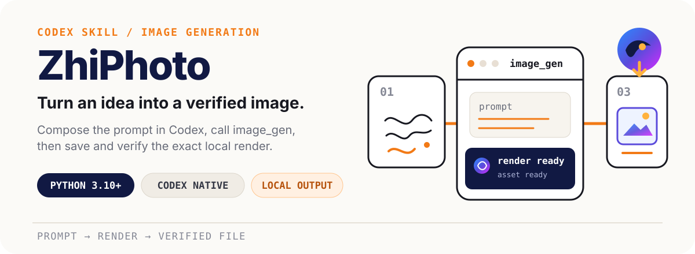
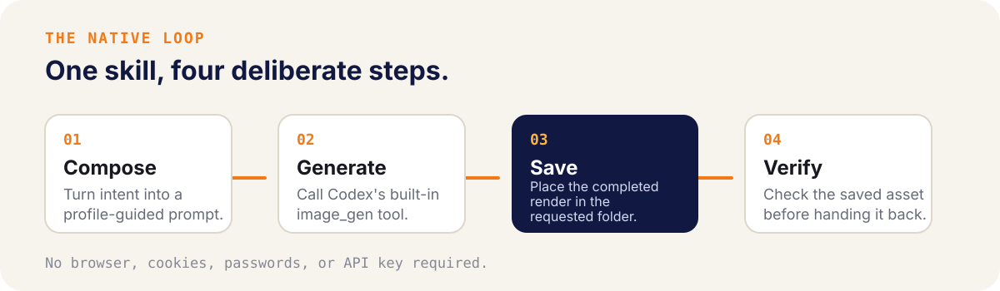
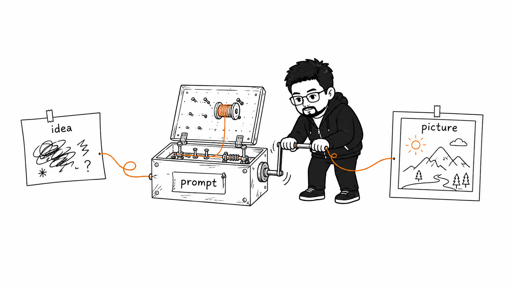
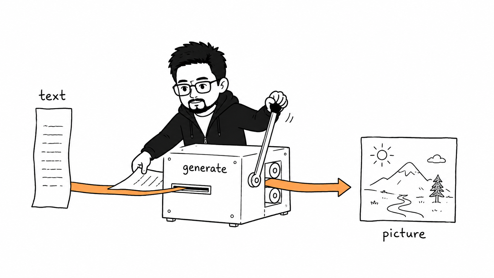
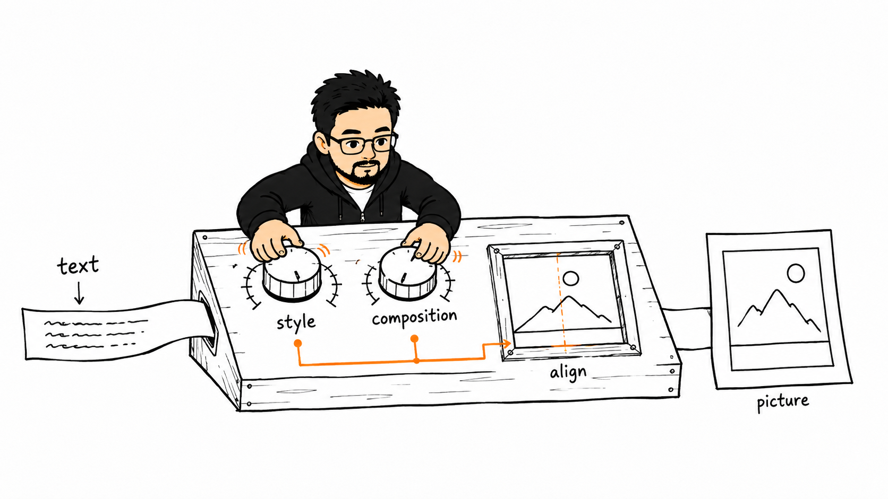
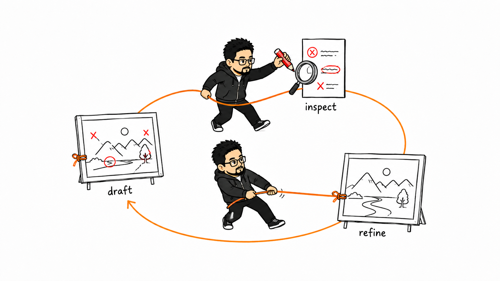
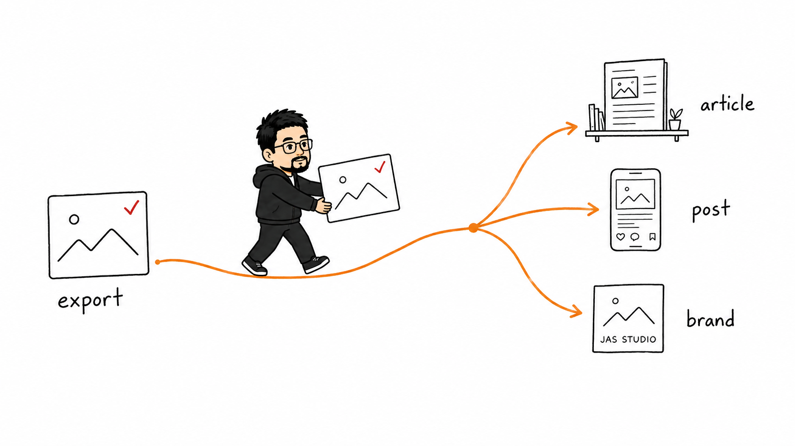
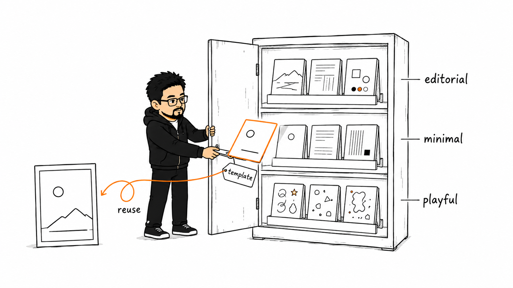

# ZhiPhoto

<p align="center">
  
</p>

<p align="center">
  <a href="README.zh-CN.md">简体中文</a>
  ·
  <code>Python 3.10+</code>
  ·
  <code>Codex image_gen</code>
  ·
  <a href="https://zhi-ai-lab.github.io/zhiphoto/">Project page</a>
  ·
  <code>Apache-2.0</code>
</p>

ZhiPhoto is an extensible Codex skill for composing image prompts and either generating images through Codex's built-in image-generation tool (then verifying the saved result), or — when what's asked for is prompts rather than images — handing off a batch as a local, offline web page for you to run yourself in your own image-generation session.

## See the loop

<p align="center">
  
</p>

The workflow keeps prompt composition, image generation, and verification together—so the first successful action is simply asking Codex to make an image.

## From idea to picture

These local examples show the visual path ZhiPhoto is built around: start with intent, shape the prompt, control style and composition, iterate, and put the verified output into content.

| 01 · Idea to picture | 02 · Text to picture |
|---|---|
|  |  |

| 03 · Control style and composition | 04 · Iterate toward a better result |
|---|---|
|  |  |

| 05 · Put the output into content | |
|---|---|
|  | |

| 07 · Multiple photo style template collections | |
|---|---|
|  | |

## What it does

- Builds prompts from the selected image type and profile guidance.
- Generates the image through Codex's built-in image-generation tool and waits for the completed render.
- Locates the tool's saved output file and moves it into the resolved destination directory.
- Saves the verified asset to the requested local destination with collision-safe naming and format checks. By default, every run gets its own timestamped folder under `.local/output/` holding the image together with a `<basename>.prompt.md` sidecar recording the exact prompt that was submitted.
- When the request's deliverable is prompts instead of images (for example "generate 10 prompts for..."), composes the same way but skips `image_gen` entirely: it writes a timestamped folder under `.local/output/` holding a machine-readable `batch.json` manifest and a self-contained `prompts.html` page. Each prompt card shows a copy button, a reference badge stating whether — and what — to attach when you run it in your own image-generation session, and a toggle to mark it tested once you've reviewed the result yourself.

## First use

### Requirements

- Python 3.10 or newer. The catalog and tests use only the Python standard library.
- Codex with its built-in `image_gen` tool available — no browser, no login, and no API key needed for generation itself.
- Local filesystem access to the chosen output directory and the ability to inspect the saved image.

### Install

Install the public GitHub marketplace, then install the plugin by its marketplace-qualified name:

```bash
codex plugin marketplace add zhi-ai-lab/zhiphoto
codex plugin add zhiphoto@zhi-ai-lab
```

The marketplace entry is pinned to `v1.0.2`. Restart or reload Codex skill discovery after installation when required by the host application.

### Quick install (npx skills)

Recommended for Codex via [`skills`](https://www.npmjs.com/package/skills):

```bash
npx skills add zhi-ai-lab/zhiphoto --skill zhiphoto --agent codex --global --yes --copy
```

Re-running this command updates the install to the repository's current state. The repository is the single source of truth; installed copies are never hand-edited.

### Ask for an image

```text
Use $zhiphoto to create a sunlit travel poster and save it locally.
```

Automatic invocation is enabled, so ordinary single-image text-to-image requests can also activate the skill unless another generator is selected.

### Ask for prompts instead

```text
Use $zhiphoto to generate 10 prompts for window-light portraits — I'll test them myself in my own image-generation tool.
```

Explicit prompt-deliverable phrasing like this routes to the prompt-handoff mode instead of generation: ZhiPhoto composes the batch and writes a local `prompts.html` page (plus its `batch.json` manifest) for you to copy from and run in your own image-generation session. No image is generated here, and no external website is opened, linked to, or automated in this mode — you paste, attach references, and review the results yourself.

## How the repository is shaped

```text
skills/zhiphoto/
├── SKILL.md
├── agents/openai.yaml
├── scripts/
│   ├── image_catalog.py
│   └── prompt_page.py
└── references/
    ├── image-profile-authoring.md
    ├── transport/
    │   ├── codex-image-gen.md
    │   └── prompt-handoff.md
    └── types/
        └── <type-id>/
            ├── TYPE.md
            ├── foundations/...
            └── profiles/**/*.md
```

`SKILL.md` is a stable router; it also decides which of the two transports below a request belongs to. `image_catalog.py` discovers valid type and profile references, validates the catalog, and returns the guidance the agent must read. Two transport references share that same routing output: `codex-image-gen.md` owns `image_gen` invocation, output-file placement, filename collision handling, format detection, and final visual verification; `prompt-handoff.md` owns composing a batch into `batch.json` and rendering it — via the deterministic `scripts/prompt_page.py` — into a local `prompts.html` page, with no `image_gen` call and no external-site automation.

Neither the root router nor the catalog script enumerates type or profile IDs. Adding a valid type or profile does not require editing either file.

## Extend it

To add a new image type or profile:

1. Add `references/types/<type-id>/TYPE.md` using `image-type/v2`.
2. Add at least one profile under that type's `profiles/` directory using `image-profile/v1`.
3. Keep every required reference inside its type folder.
4. Keep profile `type` and `kind` consistent with the containing type.
5. Leave exactly one fallback type in the complete catalog.
6. Run the validations below.

Catalog ordering is deterministic by `sort_order` and then ID, so equal sort orders are safe. Selection is semantic from title, summary, and keywords rather than a brittle scoring table.

## Boundaries and privacy

- Image generation happens through Codex's own built-in `image_gen` tool; no third-party website is involved, and the workflow does not read cookies, stored passwords, browser profiles, or other authentication data.
- Reference images the agent loads with `view_image` stay within the Codex session; they are not uploaded to any external service.
- Unless the customer's request explicitly asks to generate directly, ZhiPhoto saves the composed prompt locally and asks the customer to confirm before actually calling `image_gen`.
- Prompt-handoff mode composes prompts and writes a local page only — it never opens, navigates to, links to, or submits anything to an external website. You copy each prompt into your own image-generation session, attach references yourself where a badge asks for one, and review the images yourself; ZhiPhoto does not automate that step.
- Single-image output is the default. Explicit multi-image requests become an ordered shot list and are generated one shot at a time.
- Generated results can contain inaccuracies or artifacts; the workflow verifies the saved file but cannot guarantee artistic or factual correctness.

## Validate

From the repository root:

```bash
python3 skills/zhiphoto/scripts/image_catalog.py validate
python3 skills/zhiphoto/scripts/image_catalog.py list-types --format json
python3 -m unittest discover -s tests -v
```

The standard Codex skill validator may also be run when available:

```bash
python3 /path/to/skill-creator/scripts/quick_validate.py skills/zhiphoto
```

## License

Copyright 2026 zhi-ai-lab.

Licensed under the [Apache License 2.0](LICENSE). See [NOTICE](NOTICE) for attribution.

## Maintainer

[Jason Shen on X](https://x.com/jason_shen_2000)

---

This is an independent project and is not affiliated with or endorsed by OpenAI. Codex and OpenAI product names are used only to describe interoperability; the Apache License does not grant trademark rights.

## Appreciation

The `article-illustration` type draws on guidance from [Ian Xiaohei Illustrations](https://github.com/helloianneo/ian-xiaohei-illustrations). We appreciate Ian's original work. This appreciation applies only to the `article-illustration` type; ZhiPhoto as a whole is independently developed.
